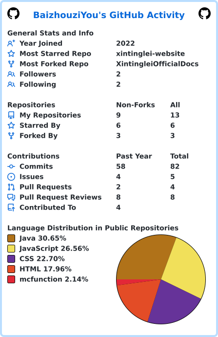

  
  

### 
This is BaiZhouziYou, an ordinary student.
  
  

- 🔭  I'm currently working on some things I'm interested in, like [CreeperBoom Mod](https://github.com/BaizhouziYou/CreeperBoom) and [XintingleiDocs](https://github.com/BaizhouziYou/XintingleiOfficialDocs)  
  

- ❓ You can ask me some questions related to Minecraft Mod technology.  
  

- ⚡ As we all know:
3x12=36 
2x12=21
1x12=12
0x12=18  
  

   

## My Skill Set  
<table><tr><td valign="top" width="33%">

### Frontend  

  
  
  
  
  
  

</td><td valign="top" width="33%">

### Backend  

  
  
  
  
  
  
  

</td><td valign="top" width="33%">

### DevOps  

  
  
  
  
  
    

</td></tr></table>  

   

## Connect with me  

  

  
  

   

## GitHub Stats

  

----

Generated using <a href="https://profilinator.rishav.dev/" target="_blank">Github Profilinator</a>

